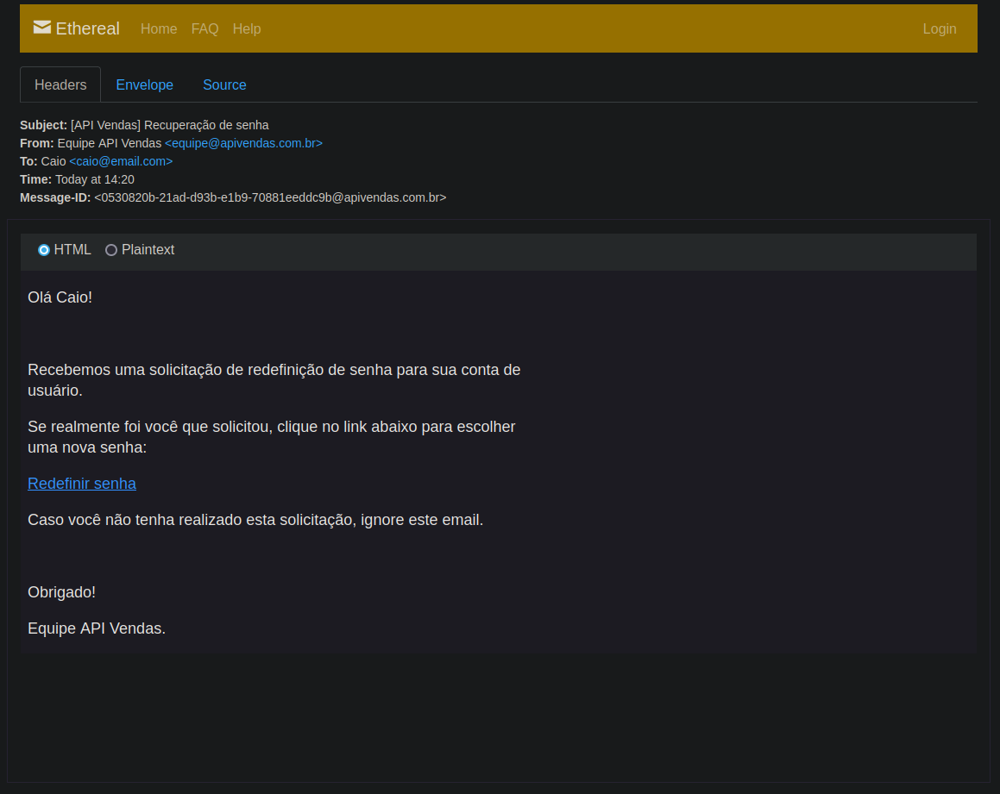

# Api-Vendas

Api-Vendas é um projeto que reproduz uma API RESTful de um e-commerce.

Este documento serve como referência técnica para a base de código. A presente documentação tem como objetivo fornecer um entendimento abrangente das principais estrutura do código, funcionalidades e mecanismos de interação com a API.

## 🚩 Índice

- [O que é Api-Vendas?](#🤖-o-que-é-api-vendas)
- [Principais características](#🎨-principais-características)
- [Como usar](#🔧-como-usar)
  

## 🤖 O Que é Api-Vendas?

O Api-Vendas se apresenta como um simulador de API RESTful, projetado para reproduzir as funcionalidades básicas de um website de vendas.
O projeto oferece um conjunto de funcionalidades essenciais para gerenciar produtos, pedidos e clientes, simulando as operações comuns em um e-commerce.

## 🎨 Principais Características 

### Login e Criação de Conta

O Api-Vendas oferece funcionalidades de login e criação de conta para gerenciar o acesso à API e proteger seus dados.
Para utilizar os endpoints que exigem autenticação, como gerenciar usuários, pedidos e clientes, é necessário realizar o login na API.

#### Opções de login  	

O login pode ser feito com um e-mail único e com uma senha.

##### Request Body

- email (string, required): The email of the user.
- password (string, required): The password of the user.

``` sh
$ curl --location 'http://localhost:8080/sessions' \
--header 'Content-Type: application/json' \
--data-raw '{
    "email":"EMAIL DO USUARIO",
    "password":"SENHA DO USUARIO"
}'
```
    
##### Response

A resposta desta solicitação é um objeto JSON com o seguinte esquema:

``` json
{
  "type": "object",
  "properties": {
    "token": {
      "type": "string"
    }
  }
}
```
*  **Sistema de autenticação via JWT** :  É gerado um token que valida as requisições do usuário.

### Criação de conta

O usuáio pode criar uma nova conta.

#### Request Body

- name (string, required): The name of the user.
- email (string, required): The email address of the user.
- password (string, required): The password for the user account.

``` sh
$ curl --location 'http://localhost:8080/users' \
--header 'Content-Type: application/json' \
--data-raw '{
    "name":"NOME DO USUARIO",
    "email":"EMAIL DO USUARIO",
    "password":"SENHA DO USUARIO"
}'
```
    
#### Response

A resposta desta solicitação é um objeto JSON com o seguinte esquema:

``` json
{
  "type": "object",
  "properties": {
    "name": {
      "type": "string"
    },
    "email": {
      "type": "string"
    },
    "id": {
      "type": "string"
    },
    "created_at": {
      "type": "string"
    },
    "updated_at": {
      "type": "string"
    },
    "avatar_url": {
      "type": ["string", "null"]
    }
  }
}
```

*  **Senhas criptografadas** :  A senha do usuário é criptografada no back-end e salva no banco de dados.

### Recuperaão de senha



O Api-Vendas oferece a funcionalidade de recuperação de senha por e-mail para auxiliar usuários que esqueceram sua senha de acesso. Através deste processo, você poderá redefinir sua senha e recuperar o controle da sua conta.

#### Evio de e-mail de recuperação

O usuário pode solicitar a recuperação de senha e receper um e-mail guiando-o para realizar o processo desejado.

#### Request Body

- email (string, required): The email address of the user who needs to reset their password.

``` sh
$ curl --location 'http://localhost:8080/password/forgot' \
--header 'Content-Type: application/json' \
--data-raw '{
    "email":"EMAIL DO USUARIO"
}'
```
    
#### Response

The response of this request is a JSON object conforming to the following schema:

``` json
{
  "type": "object",
  "properties": {
    "message": {
      "type": "string"
    }
  }
}
```

> **_NOTE:_**  Após realizar a solicitação será criado um link para a visualização do email, que poderá ser encontrado no log do docker compose.
  
*  **Token** : Através dessa solicitação será possível, em um determinado intervalo de tempo, redefinir a senha através de um token presente em um link no corpo do e-mail.

### Redefinir Senha
O usuário podera redefinir a sua senha.

#### Request Body

- token (string): The token received for password reset
- password (string): The new password
- password_confirmation (string): Confirmation of the new password

``` sh
$ curl --location 'http://localhost:8080/password/reset' \
--header 'Content-Type: application/json' \
--data '{
    "token":"TOKEN ENVIADO NO E-MAIL",
    "password": "PASSWORD",
    "password_confirmation": "PASSWORD"
}'
```

#### Response

Após o envio bem-sucedido, a resposta incluirá as informações atualizadas do usuário junto com uma mensagem de sucesso. Em caso de erro, a resposta incluirá uma mensagem de erro detalhando o problema.
  
### Avatar de usuário

Permite que os usuários enviem suas fotos de perfil para serem armazenadas no servidor da API.

#### Request Body

- `avatar` (file): The new avatar image file to be uploaded.

``` sh
$ curl --location --request PATCH 'http://localhost:8080/users/avatar' \
--header 'Authorization: Bearer TOKEN' \
--form 'avatar=@"PATH TO IMAGE"'
```

### Outros endpoints

Todos os endpoints estão documentados no **Postman**. Utilize o código: **21095332-23f92b75-16ab-47e3-b9c7-c532a419bd52**, para importar o projeto dentro do aplicativo
    
#### Response

Após o envio bem-sucedido, o avatar do usuário será modificado. Em caso de erro, a resposta incluirá uma mensagem de erro detalhando o problema.
    
## 🔧 Como Usar
  
Para executar o projeto localmete basta seguir os passos a baixo.

### Setup

> **_NOTE:_**  Para esta etapa é necessário ter instalado em sua máquina o Docker e Docker Compose.

Clone o projeto em sua máquina local.

```sh
$ git  clone  https://github.com/caio-couto/api-vendas.git

$ cd api-vendas
```
Dentro do diretório do projeto inicie o container de desenvolvimento com o comado abaixo:

```sh
$ docker compose up
```
Olhe com atenção para os logs da aplicação para a identificação de errors. Se tudo ocorrer bem sua aplicação estará funcionando e esperando solicitações na porta **8080**

#### Possíveis erros
- Se seu sistema operacional for uma distro linux então talvez seja necessário dar permissões de privilégio ao aquivo '.docker/entrypont.sh'
basta dar o seguinte comando: 
```sh
$ chmod +x .docker/entrypoint.sh
```

- Se ocorrer erros ao inicializar o banco de dados ou para realizar as migrações, uma possível causa é a extensão **uui-ossp** que deve estar instalada no banco.

## 📜 License

This software is licensed under the [MIT](https://github.com/nhn/tui.editor/blob/master/LICENSE) ©.